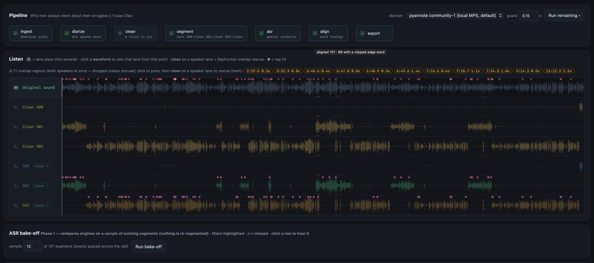
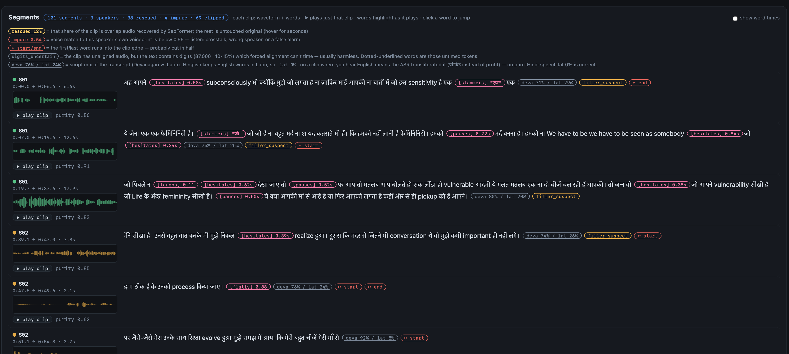

# voice-tag-studio

A local data-annotation workbench for building **emotion-tagged TTS datasets** from
Hindi/Hinglish audio — podcasts, calls, YouTube, anything with speech.

Feed it audio, and it produces training rows of the form:

```
speaker: जो पिघले न [hesitates] देखा जाए तो [pauses] पर आप तो मतलब आप बोलते हो
```

…paired with the exact voice clip. Run it in a browser to inspect every decision
by ear, or headless over a folder of files.



*The pipeline runs stage by stage — you click each one. Below it, every version of
the audio on one timeline: the original, a SepFormer-cleaned lane per speaker, and
the raw diarized lanes. Amber marks show where speakers overlap; pink diamonds are
tag hits.*

---

## Pipeline

```
ingest → diarize → [clean] → asr → align → segment → detectors → export
```

Transcription happens **before** cutting: each speaker's lane is transcribed in
~60 s chunks and force-aligned, and clips are then cut **only in verified gaps
between words**. Text↔audio match holds by construction — a boundary can never
truncate a word, because word positions are known before any cut is made.

| stage | what it does | model |
|---|---|---|
| **ingest** | YouTube URL or uploaded file → archival master + 16 kHz working wav | yt-dlp, ffmpeg |
| **diarize** | who speaks when | `pyannote/speaker-diarization-community-1` (MPS) |
| **clean** *(optional)* | rescues overlapped speech instead of discarding it | SepFormer + ECAPA purity gate |
| **asr** | verbatim Hinglish lane transcript in ~60 s chunks, **fillers preserved** | Gemini 2.5 Flash (or srota) |
| **align** | word-level timestamps on the lane, unaligned-speech "islands" | torchaudio `MMS_FA` + uroman |
| **segment** | cuts 2–20 s clips **only in verified word gaps**; clip text is derived from the aligned words inside it | word timings, no model |
| **detectors** | emotion tag candidates | see below |
| **export** | `dataset.jsonl` — clip + tagged text + speaker × tag matrix | — |

Nothing runs automatically except ingest: **every stage runs when you click it**,
so you can inspect the output before moving on.

---

## Emotion tags

| family | tags | detector |
|---|---|---|
| **reactions** | `[laughs]` `[sigh]` `[gasps]` | PANNs CNN14 sound-event detection (AudioSet) |
| **beats** | `[pauses]` `[hesitates]` `[stammers]` | rules over forced alignment — deterministic, free |
| **vocal effort** | `[whispers]` | voiced-frame ratio (physics, language-independent) |
| **tone** | `[flatly]` `[cheerfully]` | per-speaker pitch percentiles |
| **states** | `[excited]` `[nervous]` `[frustrated]` `[sorrowful]` `[calm]` | audeering wav2vec2 arousal/valence, per-speaker percentiles |

Positioned tags (reactions, beats) render **inline** at the moment they occur;
utterance-level tags (tone, effort, states) render at the **start** of the line.

**These are candidates, not labels.** Reliability drops down the table: beats are
deterministic timing maths, states use an English-trained model on Hindi and are
marked weak evidence. Audition before trusting — thresholds live in
`studio/config.py::TAG_THRESHOLDS` and are meant to be tuned by ear.

---

## Setup

Requires Python 3.11+, `ffmpeg`, and a Hugging Face account.

```bash
pip install -r requirements-main.txt

# ASR worker needs its own venv (qwen-asr pins transformers 4.57, which
# conflicts with pyannote 4.x). Only needed if you use the srota engine.
python3 -m venv .venv-asr && .venv-asr/bin/pip install -r requirements-asr.txt

# one-time: accept the gated diarization model
open https://huggingface.co/pyannote/speaker-diarization-community-1
hf auth login

cp .env.example .env      # add GEMINI_API_KEY (and optionally SARVAM_API_KEY)
```

The **Preflight** banner in the UI reports anything missing, with the fix.

---

## Use it — browser

```bash
python server.py          # http://127.0.0.1:8765
```

1. **Upload audio** (short clips are ideal) or paste a **YouTube URL** → ingest runs.
2. Click **diarize**. Speaker lanes appear — click a lane name to hear only that voice,
   or name it (`agent`, `khushi`) since `SPEAKER_00` is an arbitrary label.
3. *(optional)* Click **clean** on a speaker to rescue their overlapped speech.
4. Click **asr** → **align** → **segment**. The Segments view shows each clip's
   waveform beside its words, which highlight karaoke-style as it plays.
5. **Tags** section: pick a detector, **Run detector**, then audition each hit
   with ▶ ±2s. Tags also appear inline in the transcript at their exact position.
6. Click **export** → `jobs/<id>/manifests/dataset.jsonl`.



*Each clip shows its waveform beside its words. Tags sit inline exactly where they
occur — `[hesitates] 0.58s`, `[pauses] 0.72s`, `[stammers] "एक"` — with the
quantity you can judge by ear rather than an opaque score. Words highlight
karaoke-style during playback.*

**Quality flags** shown per clip — nothing is silently dropped:
`rescued N%` (share of separated audio) · `impure 0.54` (voice mismatch) ·
`✂ start/end` (word cut in half) · `deva/lat %` (Hinglish script mix) ·
`digits_uncertain` (unaligned audio explained by digits).

---

## Use it — batch

```bash
# a folder of calls, with detectors and overlap rescue
python run_batch.py calls/ --clean --detectors beats,laughs,tones,states

# YouTube
python run_batch.py "https://youtu.be/XXXXXXXXXXX" --detectors beats

# merge every processed job into one portable corpus
python run_batch.py --collect-only --out corpus/
```

`--collect-only --out` copies the clips beside a combined `dataset.jsonl` and
prints the **speaker × tag matrix** — the artifact that tells you which
(speaker, tag) cells are interpolation at inference time and which are
extrapolation.

---

## Output

`dataset.jsonl`, one row per clip:

```json
{
  "sample_id": "EOKZrphv3QI_SPEAKER_01_0007",
  "speaker": "SPEAKER_01",
  "line": "SPEAKER_01: जो पिघले न [hesitates] देखा जाए तो [pauses] पर आप तो...",
  "text": "जो पिघले न [hesitates] देखा जाए तो [pauses] पर आप तो...",
  "text_plain": "जो पिघले न देखा जाए तो पर आप तो...",
  "tags": ["hesitates", "pauses"],
  "wav": "segments/SPEAKER_01/EOKZrphv3QI_SPEAKER_01_0007.wav",
  "dur": 17.9, "split": "train",
  "source": "clean:sepformer", "separated_frac": 0.13,
  "purity": 0.83, "align_status": "filler_suspect", "clipped": []
}
```

Every row carries its provenance and quality flags, so any filtered subset is
reproducible without re-running anything. Clips are 16 kHz mono PCM_16; the
original best-quality download is always kept as `master.*`.

---

## Design rules

Carried over from the production voice pipeline this grew out of:

- **Precision over recall.** A wrong tag is a text↔audio mismatch — hallucination
  fuel. A missed tag is merely unused data.
- **Never train on two voices.** Other speakers' turns are subtracted with a guard
  band; overlap is dropped unless separation passes a voiceprint gate.
- **Separated audio is a repair, not a replacement.** Solo speech always keeps the
  original; only genuinely overlapped seconds are reconstructed, and they stay flagged.
- **Per-speaker percentiles** for anything prosodic — never absolute thresholds.
- **Split by video, never by segment** — same-conversation leakage is invisible
  and fatal.
- **Neutral rows matter.** A speaker needs untagged rows for tags to mean anything.

`DETECTOR_EVAL_PLAN.md` tracks the model bake-offs still to run.
